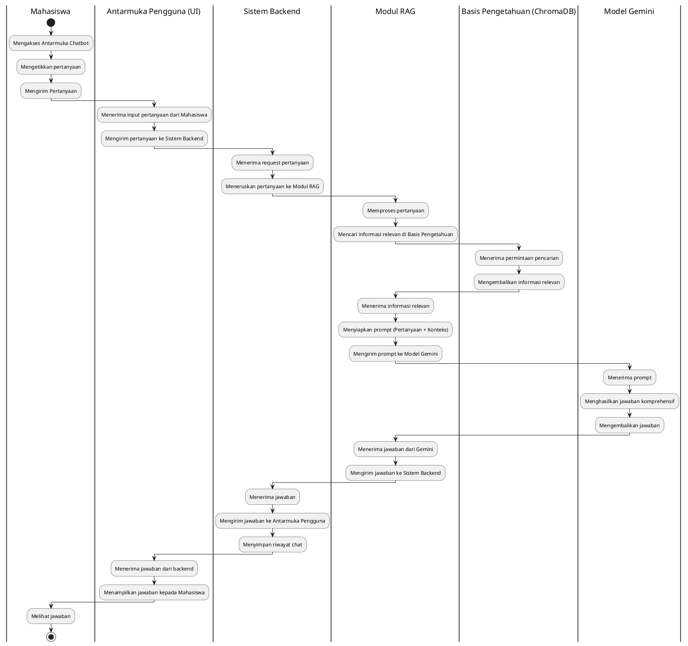
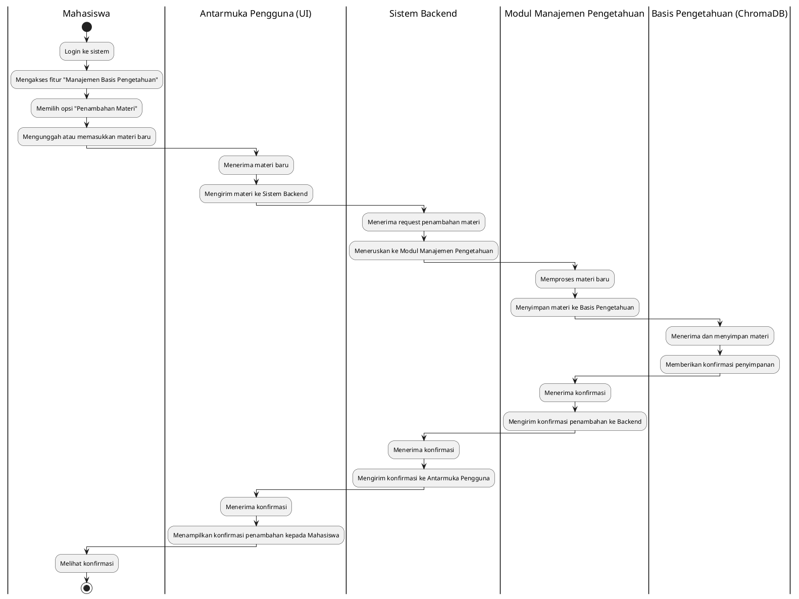
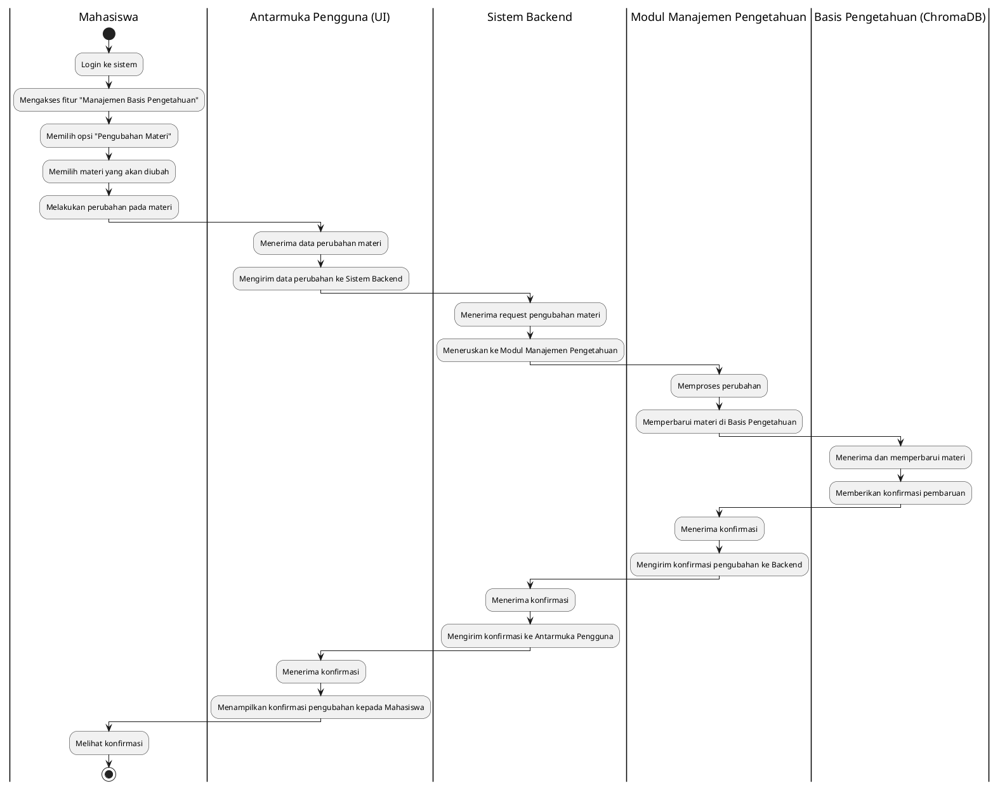
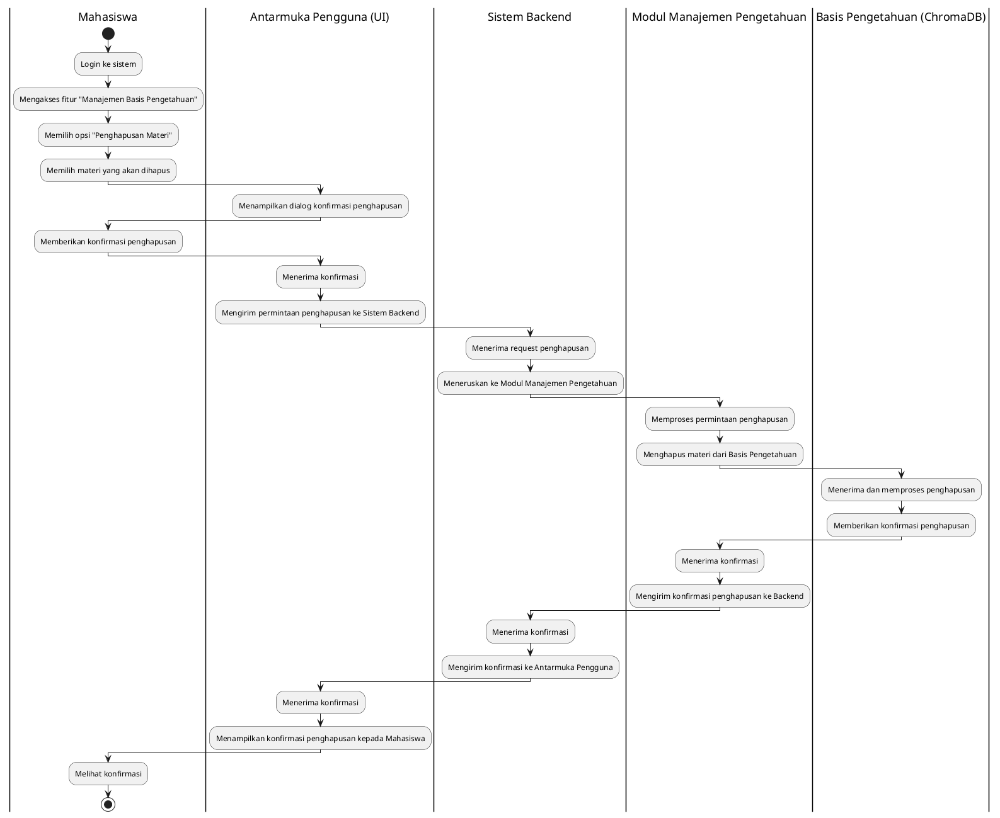
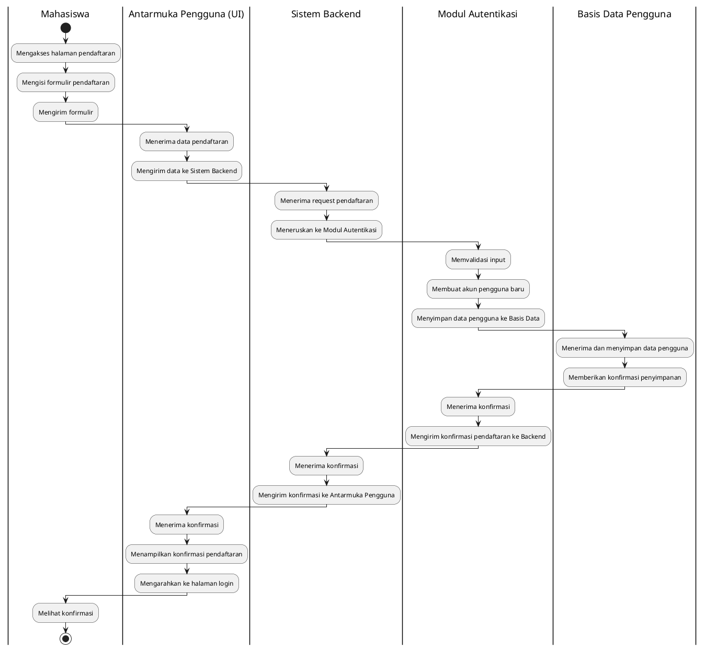
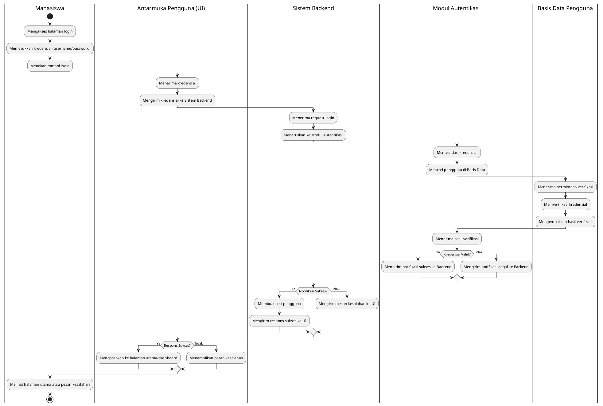

## 1. Activity Diagram: Interaksi Chatbot

## 2. Activity Diagram: Manajemen Basis Pengetahuan

### 2.1. Penambahan Materi

### 2.2. Pengubahan Materi

### 2.3. Penghapusan Materi

## 3. Activity Diagram: Autentikasi Pengguna

### 3.1. Pendaftaran Pengguna Baru

### 3.2. Login Pengguna

