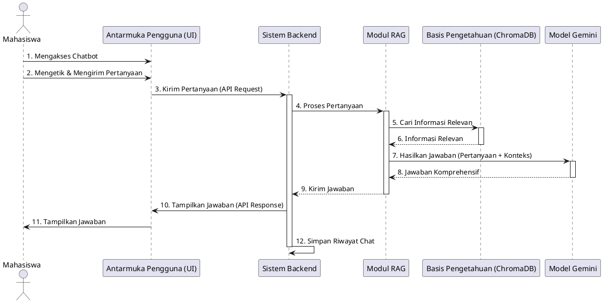
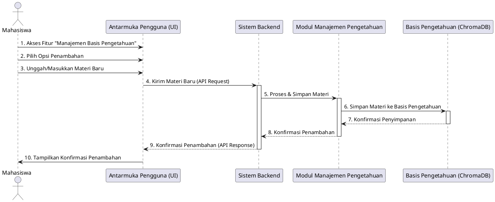
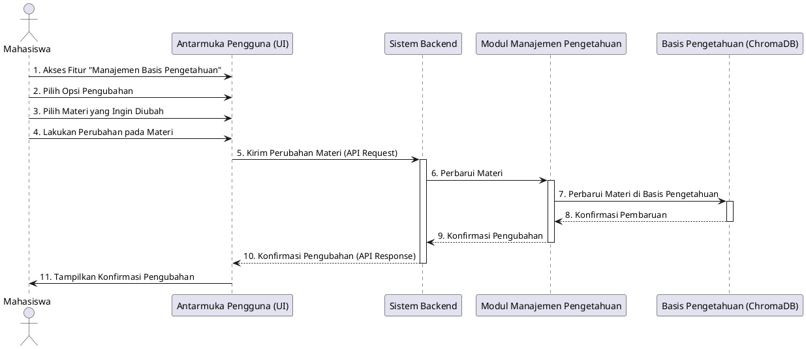
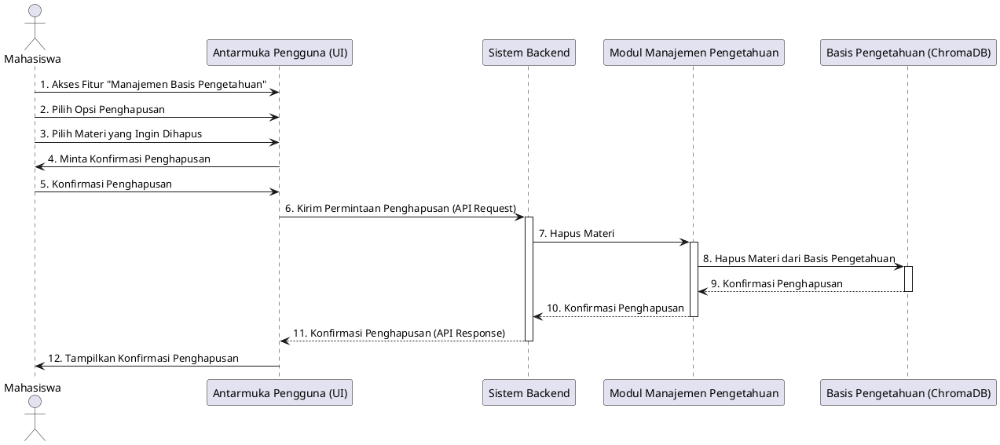
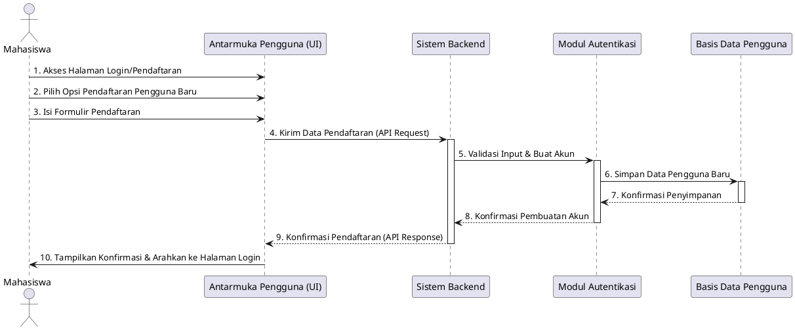
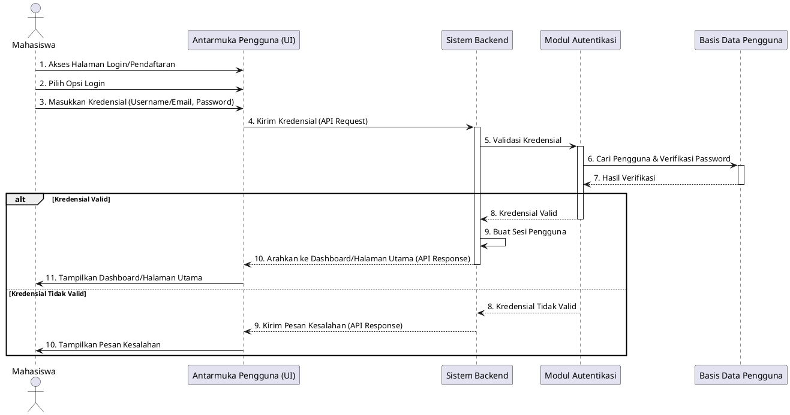

# Diagram Sekuens (Sequence Diagram) Sistem Chatbot Materi Perkuliahan

Dokumen ini berisi diagram sekuens (sequence diagram) dalam format PlantUML untuk setiap alur utama dari kasus penggunaan yang dijelaskan dalam `functional_requirements.md`. Fokus utama adalah interaksi antara pengguna (Mahasiswa) dan sistem, serta komponen-komponen internal sistem.

---

## 1. Use Case: Interaksi Chatbot (Mahasiswa)

Diagram ini menggambarkan alur utama ketika mahasiswa berinteraksi dengan chatbot untuk mengajukan pertanyaan dan menerima jawaban.

---

## 2. Use Case: Manajemen Basis Pengetahuan (Mahasiswa)

Kasus penggunaan ini dibagi menjadi tiga sub-alur utama: Penambahan, Pengubahan, dan Penghapusan materi.

### 2.1. Penambahan Materi

Diagram ini menunjukkan alur penambahan materi perkuliahan baru ke basis pengetahuan.

### 2.2. Pengubahan Materi

Diagram ini menunjukkan alur pengubahan materi perkuliahan yang sudah ada di basis pengetahuan.

### 2.3. Penghapusan Materi

Diagram ini menunjukkan alur penghapusan materi perkuliahan dari basis pengetahuan.

---

## 3. Use Case: Autentikasi Pengguna (Mahasiswa)

Kasus penggunaan ini dibagi menjadi dua sub-alur utama: Pendaftaran Pengguna Baru dan Login Pengguna.

### 3.1. Pendaftaran Pengguna Baru

Diagram ini menunjukkan alur pendaftaran akun baru oleh mahasiswa.

### 3.2. Login Pengguna

Diagram ini menunjukkan alur login pengguna ke sistem.

