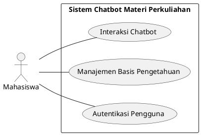

# Diagram Use Case Sistem Chatbot Materi Perkuliahan

Berikut adalah diagram use case untuk sistem chatbot materi perkuliahan berdasarkan analisis kebutuhan fungsional.

```plantuml
@startuml
left to right direction
actor Mahasiswa

rectangle "Sistem Chatbot Materi Perkuliahan" {
  usecase "Interaksi Chatbot" as UC1
  usecase "Manajemen Basis Pengetahuan" as UC2
  usecase "Autentikasi Pengguna" as UC3

  Mahasiswa -- UC1
  Mahasiswa -- UC2
  Mahasiswa -- UC3
}
@enduml
```